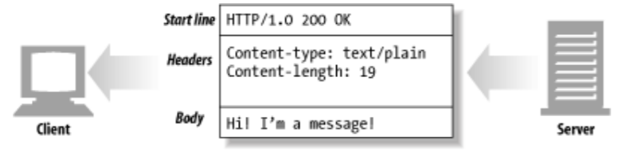

# HTTP 메시지
- 목표
  - 메시지가 어떻게 플러가는가
  - HTTP 메시지의 세 부분(시작줄, 헤더, 개체 본문)
  - 요청과 응답 메시지의 차이
  - 요청 메시지가 지원하는 여러 기능(메서드)들
  - 응답 메시지가 반환하는 여러 상태 코드들
  - 여러 HTTP 헤더들은 무슨 일을 하는가


## 3.1 메시지의 흐름
- HTTP 메시지
  - HTTP 애플리케이션 간에 주고받은 `데이터의 블록`
  - 메시지의 내용과 의미를 설명하는 `메타 정보`로 시작하고, 선택적으로 `데이터`가 올 수 있음 
  - 메시지는 클라이언트, 서버, 프락시 사이를 흐름
  - 메시지가 흘러가는 방향에 따라 '인바운드', '아웃바운드', '업스트림', '다운스트림'으로 나뉨

### 3.1.1 메시지는 원 서버 방향을 인바운드로 하여 송신된다
- 인바운드
  - 메시지가 원 서버로 향하는 것
- 아웃바운드
  - (모든 처리가 끝난 후에) 메시지가 사용자 에이전트로 돌아오는 것
    


[그림 3-1 원 서버로 인바운드로 이동하고 클라이언트로 아웃바운드로 복귀하는 메시지]

### 3.1.2 다운스트림으로 흐르는 메시지
- 모든 메시지는 (요청 메시지, 응답 메시지인지와 상관 없이) 다운스트림으로 흐름


[그림 3-2 모든 메시지는 다운스트림으로 흐른다.]

- 메시지의 발송자는 수신자의 업스트림임
  - 그림 3-2
    - 요청에선 프락시 1이 프락시 3의 업스트림
    - 응답에선 프락시 3이 프락시 1의 업스트림


## 3.2 메시지의 각 부분
- 어떤 메시지인지를 서술하는 `시작줄`, 속성을 나타내는 `헤더 블록`, 데이터를 담고있는 `본문`으로 나뉨



[그림 3-3 HTTP 메시지의 세 부분]

- 시작줄과 헤더블록은 줄 단위로 구분함
  - 각 줄은 두 글자의 줄바꿈 문자열(`CRLF`)로 끝남
- 본문은 데이터 덩어리로, 선택사항임
  - 텍스느타 이진 데이터를 포함할 수 있고 비어있을 수도 있음

### 3.2.1 메시지 문법
- 모든 HTTP 메시지는 요청 메시지나 응답 메시지로 분류됨
  - 요청 메시지
    - 웹 서버에 어떤 동작을 요구함
  - 응답 메시지
    - 요청의 결과를 클라이언트에게 돌려줌
- 두 메시지의 구조는 기본적으로 같음


[그림 3-4 요청과 응답 메시지를 포함한 HTTP 트랜잭션]

- 형식

|  | 요청 메시지 | 응답 메시지 |
| --- | --- | --- |
|시작줄|<메서드> <요청 URL> <HTTP 버전>|<HTTP 버전> <상태 코드> <사유 구절>|
|헤더|<헤더>|<헤더>|
|(빈 줄)|||
|본문|<엔터티 본문>|<엔터티 본문>|

### 3.2.2 시작줄
- 모든 HTTP 메시지는 시작줄로 시작함
- 요청 메시지의 시작줄(요청줄)은 무엇을 해야하는지, 응답 메시지의 시작줄(응답줄)은 무슨 일이 일어났는지를 말해줌
  - 요청줄
    - [메서드](#33-헤더): 서버에서 어떤 동작이 일어나야 하는지를 설명함
    - 요청 URL: 동작(메서드)에 대한 대상을 지칭함
    - HTTP 버전: 클라이언트가 어떤 HTTP 버전으로 말하고 있는지 서버에게 알려줌
  - 응답줄
    - HTTP 버전: 응답 메시지에 쓰인 HTTP 버전
    - [상태 코드](#34-상태-코드): 숫자로 구성
    - 사유 구절: 상태 코드에 대한 글로된 설명을 제공함
  - 요청줄과 응답줄의 모든 필드는 공백으로 구분
- 예시:


[그림 3-5 요청과 응답 메시지의 예]

  - 요청 메시지
    - 메서드: GET
    - 요청 URL: /test/hi-there.txt
    - HTTP 버전: HTTP/1.1
  - 응답 메시지
    - HTTP 버전: HTTP/1.0
    - 상태 코드: 200
    - 사유 구절: OK

### 3.2.3 헤더
- 시작줄 다음에 오고, 0개, 1개 혹은 여러개의 HTTP 헤더가 옴
- 요청과 응답 메시지에 추가 정보를 더해줌
- 이름/값 쌍의 목록
- 문법: 이름, 콜론(:), 공백(없어도 됨), 필드 값, CRLF가 순서대로 옴

| 헤더의 예 | 설명 |
| --- | --- |
|Date: Tue, 3 Oct 1997 02:16:03 GMT|서버가 응담을 만들어 낸 시각|
|Content-length: 15040 |15,040바이트의 데이터를 포함한 엔터티 본문|
|Content-type: image/gif|엔터티 본문은 GIF 이미지다|
|Accept: image/gif, image/jpeg, text/html |클라이언트는 GIF, JPEG 이미지와 HTML을 받아들일 수 있다.|

- 헤더를 여러 줄로 나누는 것도 가능함
  - 추가 줄 앞에는 최소 하나의 스페이스 혹은 탭 문자가 와야함
  - 예시:
    - 헤더의 완전한 값: 'Test Server Version 1.0'
```text
HTTP/1.0 200 OK
Content-Type: image/gif
Content-Length: 8572
Server: Test Server
 Version 1.0 
```

### 3.2.4 엔터티 본문
- HTTP 메시지의 화물로, HTTP가 수송하게 됨
- 이미지, 비디오, HTML문서, 소프트웨어 애플리케이션, 신용카드 트랜잭션, 전자 우편 등 여러 종류의 디지털 데이터를 실어 나를 수 있음

### 3.2.5 버전 0.9 메시지
- HTTP 프로토콜의 초기버전(0.9)에서 쓰이던 메시지 형식


## 3.3 메서드
- 요청의 시작줄에 있으며, 서버에게 무엇을 해야 하는지 말해줌
- 많이 쓰이는 HTTP 메서드
| 메서드 | 설명 | 메시지 본문이 있는가? |
| --- | --- | --- |
| GET | 서버에서 어떤 문서를 가져온다. | 없음 |
| HEAD | 서버에서 어떤 문서에 대한 헤더만 가져온다. | 없음 |
| POST | 서버가 처리해야 할 데이터를 보낸다. | 있음 |
| PUT | 서버에 요청 메시지의 본문을 저장한다. | 있음 |
| TRACE | 메시지가 프락시를 거쳐 서버에 도달하는 과정을 추적한다. | 없음 |
| OPTIONS | 서버거 어떤 메서드를 수행할 수 있는지 확인한다. | 없음 |
| DELETE | 서버에서 문서를 제거한다. | 없음 |


## 3.3.1 안전한 메서드
- HTTP 요청의 결과로 인해 서버에서 일어나는 일이 아무것도 없는 메서드
- GET, HEAD 메서드가 안전한 메서드에 속함

### 3.3.2 GET
- 가장 많이 쓰이는 메서드로 서버에게 리소스를 달라고 요청할 때 쓰임


[그림 3-7 GET의 예]

### 3.3.3 HEAD
- GET처럼 동작하지만, 응답 메시지에 헤더만 있음(본문 없음)
  - 리소스를 가져오지 않고도 타입 등의 정보를 알아낼 수 있음
  - 응답 상태 코드를 보고 개체가 존재하는지 확인할 수 있음
  - 리소스가 변경되었는지 여부를 확인할 수 있음
- 서버 개발자들은 GET과 HEAD의 헤더가 정확히 일치하도록 구현해야 함


[그림 3-8 HEAD의 예]

### 3.3.4 PUT
- 서버에 문서를 씀
  - 요청 본문을 가지고 요청 URL의 이름대로 새 문서를 만들거나, 이미 URL이 존재한다면 본문을 사용해서 교체함
  - 콘텐츠 변경이 수반되기 때문에 많은 웹서버가 PUT을 수행하기 전에 비밀번호를 입력해서 로그인을 하도록 요구함


[그림 3-9 PUT의 예]

### 3.3.5 POST
- 서버에 입력 데이터를 전송하기 위해 설계된 메서드
  > POST는 서버에 데이터를 보내기 위해 사용함. PUT은 서버에 있는 리소스(예: 파일)에 데이터를 입력하기 위해 사용함
  - HTML 폼을 지원하기 위한 용도로 주로 사용됨


[그림 3-10 POST의 예]

### 3.3.6 TRACE
- 클라이언트에게 자신의 요청이 서버에 도달했을 때 어떻게 보이게 되는지 알려주는 메서드
- 진단을 위해 주로 사용됨


[그림 3-11 TRACE의 예]

### 3.3.7 OPTIONS
- 웹 서버에게 여러 가지 종류의 지원 범위에 대해 물어봄
  - 특정 리소스에 대해 어떤 메서드가 지원되는지 물어볼 수 있음
- 리소스에 실제로 접근하지 않고도 어떤 접근 방식이 최선인지 확인할 수 있음
- 예시:
  - `Allow: GET, POST, PUT, OPTIONS`


[그림 3-12 OPTIONS의 예]

### 3.3.8 DELETE
- 웹 서버에게 요청 URL로 지정한 리소스를 삭제할 것을 요청함
  - 삭제가 수행되는것은 보장받지 못함


[그림 3-13 DELETE의 예]

### 3.3.8 확장 메서드
- HTTP/1.1 명세에 정의되지 않은 메서드로, 개발자가 필요에 따라 설계할 수 있음


## 3.4 상태 코드
- 상태 코드의 종류

| 전체 범위 | 정의된 범위 | 분류 |
| --- | --- | --- |
| 100-199 | 100-101 | 정보 |
| 200-299 | 20-206 | 성공 |
| 300-399 | 300-305 | 리다이렉션 |
| 400-499 | 400-415 | 클라이언트 에러 |
| 500-599 | 500-505 | 서버 에러 |
