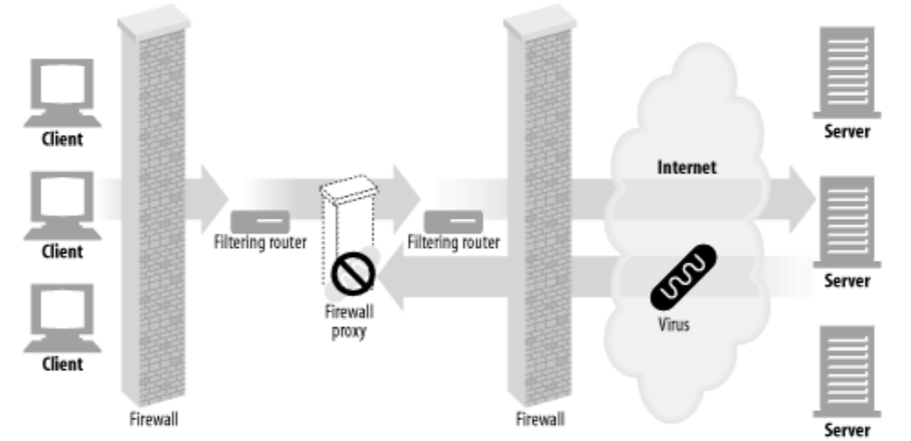

# 프락시
- 목표
  - HTTP 프락시와 웹게이트를 비교하여 HTTP 프락시가 어떻게 배치되는지 그림으로 보여주면서 설명한다. 
  - 프락시의 활용 방법
  - 프락시가 실제 네트워크에 어떻게 배치되는지, 트래픽이 어떻게 프락시 서버로 가는지 설명한다.
  - 브라우저에서 프락시를 사용하려면 어떻게 설정해야 하는지 보여준다.
  - HTTP 프락시 요청이 서버 요청과 어떻게 다른지, 프락시가 어떻게 브라우저의 동작을 미묘하게 바꾸는지 보여준다.
  - 일련의 프락시 서버들을 통과하는 메시지의 경로를 Via 헤더와 TRACE 메서드를 이용해 기록하는 방법을 설명한다.
  - 프락시에 기반한 HTTP 접근 제어를 설명한다.
  - 프락시가 어떻게 클라이언트와 서버 사이에서 각각의 다른 기능과 버전들을 지원하면서 상호작용 할 수 있는지 설명한다.


## 6.1 웹 중개자
- 웹 프락시 서버
  - 클라이언트 입장: 트랜잭션을 수행하는 중개인
  - HTTP 프락시 서버는 웹 서버이기도 하고 웹 클라이언트이기도 하다.
    - 웹 클라이언트 관점에서 서버처럼 동작함: 요청 메시지를 받고 응답 메시지를 돌려줌
    - 웹 서버 관점에서 클라이언트처럼 동작함: 웹 요청 메시지를 보내고 웹 응답 메시지를 받음
  
  
  
  [그림 6-1 프락시는 서버이면서 동시에 클라이언트여야 한다.]

### 6.1.1 개인 프락시와 공유 프락시
- 개인 프락시
  - 하나의 클라이언트가 독점적으로 사용하는 프락시
- 공유 프락시
  - 여러 클라이언트가 공유하는 프락시
  - 대부분의 프락시가 공유 프락시임
    
### 6.1.2 프락시 vs. 게이트웨이
- 프락시
  - 같은 프로토콜을 사용하는 둘 이상의 애플리케이션을 연결함
- 게이트웨이
  - 서로 다른 프로토콜을 사용하는 둘 이상의 애플리케이션을 연결함
  - 프로토콜이 서로 다르더라도 서로 간의 트랜잭션을 완료할 수 있도록 해주는 프로토콜 변환기처럼 동작함
- 실제 둘의 차이는 모호함

  

[그림 6-2 프락시는 같은 프로토콜로 말하고 게이트웨이는 서로 다른 프로토콜을 연결해준다.]


## 6.2 왜 프락시를 사용하는가?
- 실질적이고 유용한 것이라면 무슨 일이든 함
- 보안, 성능, 비용, 트래픽 감시 및 처리 등의 기능을 함
- 예시
  - 어린이 필터: 성인 콘텐츠 차단
  - 문서 접근 제어자: 웹 리소스에 대한 단일 접근 제어 전략을 구사, 감사 추적
  - 보안 방화벽: 조직 안에 들어오거나 나가는 응용 레벨 프로토콜의 흐름을 네트워크의 한 지점에서 통제함
  - 웹 캐시: 인기 있는 문서의 로컬 사본을 관리하고 해당 문서에 대한 요청이 오면 빠르게 제공함
  - 대리 프락시(Surrogate): 웹 서버인 것처럼 위장함. 웹 요청을 받지만, 웹 서버와는 달리 요청받은 콘텐츠의 위치를 찾아내기 위해 다른 서버와 커뮤니케이션함. 공용 콘텐츠에 대한 느린 웹 서버의 성능을 개선하기 위해 사용됨(서버 가속기) 
  - 콘텐츠 라우터: 인터넷 트래픽 조건과 콘텐츠의 종류에 따라 요청을 특정 웹 서버로 유도함
  - 트랜스코더: 콘텐츠를 클라이언트에게 전달하기 전에 본문 포맷(데이터 표현 방식)을 수정함(트랜스코딩). 예: GIF to JPG, 파일 압축, 언어 변환 등
  - 익명화 프락시(Anonymizer): HTTP 메시지에서 신원을 식별할 수 있는 특성들(IP주소, From헤더, Referer헤더, 쿠키, URI 세션 아이디 등)을 제거해 개인 정보 보호와 익명성 보장에 기여함


[그림 6-3 어린이를 보호하는 인터넷 필터]


[그림 6-4 중앙화된 문서 접근 제어]



[그림 6-5 보안 방화벽]


[그림 6-6 웹캐시]

[](../images/6-7.png)

[그림 6-7 대리 프락시 웹캐시]

[](../images/6-8.png)

[그림 6-8 콘텐츠 라우팅]


[그림 6-9 콘텐츠 트랜스코더]


[그림 6-10 익명화 프락시]


## 6.3 프락시는 어디에 있는가?
- 프락시가 어떻게 네트워크에 배치되는가?
- 어떻게 프락시의 연쇄가 계층을 이루는가?

### 6.3.1 프락시 서버 배치
- 프락시가 어떻게 네트워크에 배치되는가?
  - 사용 목적에 따라 배치 방법이 달라짐
    - 출구 프락시
    - 접근(입구) 프락시
    - 대리 프락시
    - 네트워크 교환 프락시
  
  
  
  [그림 6-10 (a) 개인 LAN 출구 프락시, (b) ISP 접근 프락시, (c) 대리 프락시, (d) 네트워크 교환 프락시]
  
### 6.3.2 프락시 계층
- 어떻게 프락시의 연쇄가 계층을 이루는가?
   - 프락시가 이루는 연쇄 구조
   - 다음번 인바운드 프락시(서버에 가까운 쪽)를 부모라고 부르고 다음번 아웃바운드 프락시(클라이언트에 가까운 쪽)를 자식이라고 부름
   
  
 
  [그림 6-12 3단계 프락시 계층. 프락시 2는 프락시 3의 자식 프락시이며, 프락시 3은 프락시 2의 부모 프락시임]

  - 프락시 계층은 정적일 수도 있고 동적일 수도 있음
  - 동적 부모 선택의 유형
    - 부하 균형
    - 지리적 인접성에 근거한 라우팅
    - 프로토콜/타입 라우팅
    - 유료 서비스 가입자를 위한 라우팅
    
  
         
  [그림 6-13 프락시 계층은 동적으로 매 요청에 따라 바뀔 수 있다.]
  
### 6.3.3 어떻게 프락시가 트래픽을 처리하는가
- 클라이언트 트래픽이 프락시로 가도록 만드는 방법
  - 클라이언트를 수정함(a): 인터셉트 프락시
  - 네트워크를 수정함(b)
  - DNS 이름 공간을 수정함(c)
  - 웹 서버를 수정함(d): 웹 서버에서 HTTP 요청을 프락시로 리다이렉트 함
  
  
           
  [그림 6-14 웹 요청을 프락시로 보내는 다양한 방법]
  
  
## 6.4 클라이언트 프락시 설정
- 모던 브라우저에서 프락시를 설정하는 방법
  - 수동 설정
    - 브라우저의 메뉴를 이용해 설정
  - 브라우저 기본 설정: 브라우저 벤더나 배포자가 설정
  - 프락시 자동 설정(Proxy auto-configuration, CPA): 자바스크립트 프락시 자동 설정 파일에 대한 URI를 제공함
    - 프락시 설정을 그때그때 상황에 맞게 계산해주는 자바스크립트 함수가 적절한 프락시 서버를 선택해줌
    - 자바스크립트 PAC 파일의 URI를 브라우저에 설정해주어야 함
      - *.pac
      - MIME 타입: 'application/x-ns-proxy-autoconfig'
      - 각 PAC파일엔 반드시 URI에 접근할 때 사용할 적절한 프락시 서버를 계산해주는 FindProxyForUrl(url, host)라는 함수를 정의해야 함
  - 웹 프락시 자동발견 프로토콜(Web Proxy Autodiscovery Protocol ,WPAD)
    - 브라우저에게 알맞는 PAC 파일을 자동으로 찾아주는 알고리즘
    

# 6.5 프락시 요청의 미묘한 특징들
- 프락시 요청의 URI는 서버 요청과 어떻게 다른가
- 인터셉트 프락시와 리버스 프락시는 어떻게 서버 호스트 정보를 알아내기 어렵게 만드는가
- URI 수정에 대한 규칙
- 프락시는 브라우저의 똑똑한 URI 자동완성이나 호스트 명 확장 기능에 어떻게 영향을 주는가

### 6.5.1 프락시 URI는 서버 URI와 다르다
- 웹 서버와 웹 프락시 메시지의 문법은 서로 같지만, 한 가지 예외가 있음
  - 클라이언트가 프락시 대신 서버로 요청을 보내면 요청의 URI가 달라짐
    - 클라이언트 to 웹서버: 요청 줄이 스킴, 호스트, 포트 번호가 없는 부분 URI임
       ```
       GET /index.html HTTP/1.0
       USER-Agent: SuperBrowser v1.3
       ```
    - 클라이언트 to 프락시: 요청줄이 완전한 URI임
       ```
       GET http://www.marys-antique.com/index.html HTTP/1.0
       USER-Agent: SuperBrowser v1.3
       ```

### 6.5.2 가상 호스팅에서 일어나는 같은 문제
- 6.5.1에서 부분 URI가 쓰이는 것과 같은 문제임

### 6.5.3 인터셉트 프락시는 부분 URI를 받는다

### 6.5.4 프락시는 프락시 요청과 서버 요청을 모두 다룰 수 있다

### 6.5.5 전송 중 URI 변경

### 6.5.6 URI 클라이언트 자동확장과 호스트명 분석(Hostname Resolution)

### 6.5.7 프락시 없는 URI 분석(URI Resolution)

### 6.5.8 명시적인 프락시를 사용할 때의 URI 분석

### 6.5.9 인터셉트 프락시를 이용한 URI 분석


## 6.6 메시지 추적
프락시가 점점 흔해지면서, 서로 다른 스위치와 라우터를 넘나드는 IP 패킷의 흐름을 추적하는 것 못지않게 프락시를 넘나드는 메시지의 흐름을 추적하고 문제점을 찾아내는 것도 중요해짐

### 6.6.1 Via 헤더
  - Via 헤더 필드는 메시지가 지나는 각 중간 노드의 정보를 나열함. 메시지가 또 다른 노드를 지날 때마다, 중간 노드는 Via 목록의 끝에 추가됨.

- Via 문법
  - 쉼표로 경유지 목록을 구분함
  - 각 경유지는 개별 프락시 서버나 게이트웨이 홈을 나타냄
  - 중간 노드의 프로토콜과 주소에 대한 정보가 담김

```text 
// 2개의 경유지에 대한 Via 헤더
Via: 1.1 proxy-62.irenes-isp.net, 1.0 cache.joes-hardware.com
```  

- 헤더 형식 구문
```text
Via = "Via" ":" 1#( waypoint )
waypoint = ( received-protocol received-by [ comment ] )
received-protocol = [ protocol-name "/" ] protocol-version
received-by = ( host [ ":" port ] ) | pseudonym
```
  - 프로토콜 이름: 중개자가 받은 프로토콜
  - 프로토콜 버전: 수신한 메시지의 버전
  - 노드 이름: 중개자의 호스트와 포트 번호
  - 노드 코멘트: 중개자 노드를 서술하는 선택적인 코멘트
  - Via 요청과 응답 경로: 요청 메시지와 응답 메시지 모두 프락시를 지나므로 둘 다 Via 헤더를 가짐
  - Via와 게이트웨이
  - Server 헤더와 Via 헤더
  - Via가 개인정보 보호와 보안에 미치는 영향

### 6.6.2 TRACE 메서드
프락시 서버는 메시지가 전달될 때 메시지를 바꿀 수 있음(헤더가 추가되거나, 변경되거나, 삭제될 수 있으며, 본문이 다른 형식으로 변환될 수 있음). 변경 방식은 벤더마다 다른데, 이를 추적하기 위한 방법으로 TRACE 메서드를 사용함

HTTP/1.1의 **TRACE 메서드**는 요청 메시지를 프락시의 연쇄를 따라가면서 어떤 프락시를 지나가고 프락시가 요청 메시지를 수정하는지 관찰/추적할 수 있게 해줌 --> 프락시 흐름을 디버깅하는 데 유용함

TRACE 요청이 목적지 서버에 도착했을 때, 서버는 전체 요청 메시지를 HTTP 응답 메시지의 본문에 포함해 송신자에게 그대로 돌려보냄

  
 
  [그림 6-23 TRACE 응답은 수신한 요청 메시지를 그대로 돌려보낸다.]
  
## 6.7 프락시 인증
프락시는 접근 제어 장치로도 사용됨. HTTP는 사용자가 유효한 접근 권한 자격을 프락시에 제출하지 않는 한 콘텐츠에 대한 요청을 차단하는 프락시 인증이라는 메커니즘을 정의함

## 6.8 프락시 상호운용성
클라이언트, 서버, 벤더마다 HTTP 명세를 다르게 구현할 수 있음

### 6.8.1 지원하지 않는 헤더와 메서드 다루기
넘어오는 헤더 필드를 이해하지 못할 때 그대로 전달함

### 6.8.2 OPTIONS: 어떤 기능을 지원하는지 알아보기
HTTP OPTIONS 메서드는 서버나 웹 서버의 특정 리소스가 어떤 기능을 지원하는지 클라이언트(혹은 프락시)가 알아볼 수 있게 해준다.

  
 
  [그림 6-26 서버가 지원하는 메서드를 찾기 위해 OPTIONS 사용하기]

### 6.8.3 Allow 헤더
- Allow 엔터티 헤더 필드는 요청 URI에 의해 식별되는 자원에 대해 지원되는 메서드들이나 서버가 지원하는 모든 메서드를 열거함 
- Allow 헤더는 새 리소스가 지원했으면 하는 메서드를 추천하기 위해 요청 헤더로 사용될 수 있음
  
  