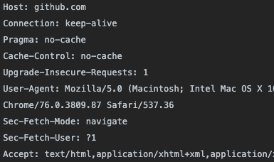
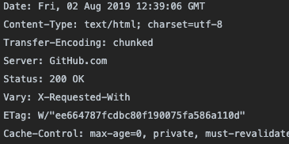
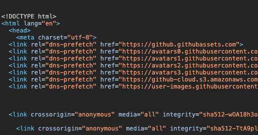

# I.HTTP: 웹의 기초_01.HTTP 개관

들어가기 전에, 이 글은 `HTTP 완벽 가이드` 책을 읽고 이해한 내용을 정리한 글입니다.

# 1장 HTTP 개관

이 챕터에서는 다음 항목들에 대해 정리합니다.

- 얼마나 많은 클라이언트와 서버가 통신하는지
- 리소스가 어디서 오는지
- 웹 트랜잭션이 어떻게 동작하는지
- HTTP 통신을 위해 사용하는 메세지의 형식
- HTTP 기저의 TCP 네트워크 전송
- 여러 종류의 HTTP 프로토콜
- 인터넷 곳곳에 설치된 다양한 HTTP 구성요소

## HTTP

HTTP는 이미지, HTML 문서, 텍스트, 동영상 등을 웹 브라우저로 옮겨줍니다. HTTP는 데이터 전송 프로토콜을 사용하는데, 이 프로토콜은 신뢰성이 높기 때문에 사용자는 HTTP를 통해 받은 정보들이 전송 중에 파괴되거나 중복되거나 변조될 것을 걱정하지 않아도 됩니다.

## 클라이언트와 서버

위에서 이야기한 이미지, HTML 문서, 텍스트, 동영상 등의 리소스들은 웹 서버에 있습니다. 웹 서버(이하 HTTP 서버)는 HTTP 클라이언트가 보낸 데이터를 저장하고, HTTP 클라이언트가 요청한 데이터를 제공해줍니다.

웹 브라우저(HTTP 클라이언트)가 서버에 HTTP 객체를 요청하면 서버가 보내준 리소스를 웹 브라우저가 처리해줍니다. 예를 들어, 크롬에서 [http://theeeeeng.github.com](https://theeeeeng.github.com) 링크로 접근하면, 크롬은  [http://theeeeeng.github.com](https://theeeeeng.githumb.com) 서버로 HTTP 요청(여기서는 index.html 요청)을 보냅니다. 요청받은 서버는 요청받은 객체를 찾고, 성공했다면 요청받은 객체의 타입, 길이 등의 정보와 함께 HTTP 응답에 실어서 클라이언트로 전송합니다.

## 리소스

웹 서버는 리소스를 관리하고 제공합니다. 웹 리소스의 예시로는 HTML, 이미지, 동영상 등이 있는데, 반드시 정적 파일일 필요는 없습니다. 동적 리소스는 사용자가 누구인지, 어떤 정보를 보여줄지 에 따라 리소스에 다른 내용들을 포함할 수 있습니다.

> MIME 타입

웹 서버는 모든 HTTP 객체 데이터에 MIME 타입을 붙입니다. 브라우저는 서버로부터 객체를 돌려받을 때, 다룰 수 있는 객체인지 MIME 타입을 통해 확인할 수 있는데, 대부분의 브라우저는 보편적인 타입 수백 가지를 다룰 수 있다고 합니다.

MIME 타입은 `주 타입`/`부 타입` 으로 이루어진 문자열 라벨입니다. 예를 들면,

- text/html
- text/plain
- image/jpeg
- image/gif

이런 형태의 MIME 타입 외에도 다양한 형태가 있습니다.

> URI, URL, URN

웹 서버 리소스는 각자 이름을 갖고 있기 때문에, 클라이언트는 원하는 리소스를 지목할 수 있습니다. 서버 리소스 이름은 URI로 불리는데, 정보 리소스를 고유하게 식별하고 위치를 지정할 수 있습니다. 

예를 들어 [https://github.githubassets.com/images/icons/emoji/octocat.png](https://github.githubassets.com/images/icons/emoji/octocat.png) 는 [https://github.githubassets.com](https://github.githubassets.com/images/icons/emoji/octocat.png) 서버에 있는 이미지 리소스에 대한 URI 입니다.

URI에는 URL(uniform resource locator), URN(uniform resource name) 두 가지 종류가 있습니다.

**URL**은 리소스 식별자의 가장 흔한 형태로 특정 서버의 리소스에 대한 구체적인 위치를 서술하며, 대부분의 URL은 세가지로 구성됩니다.

- `스킴(scheme)` 리소스에 접근하기 위해 사용되는 프로토콜을 서술합니다. ex)https://
- `서버의 인터넷 주소` ex)[github.githubassets.com](https://github.githubassets.com/images/icons/emoji/octocat.png)
- `웹 서버의 리소스` ex)[/images/icons/emoji/octocat.png](https://github.githubassets.com/images/icons/emoji/octocat.png)

**URN**은 컨텐츠를 이루는 리소스에 대해, 그 리소스의 위치에 영향받지 않는 유일무이한 이름 역할을 합니다. 예를 들어 `urn:ietf:rfc:2141` 이라는 URN은 인터넷 표준문서 'RFC 2141' 가 어디에 있거나 상관없이 그것을 지칭하기 위해 사용할 수 있습니다.

## HTTP 트랜잭션

HTTP 트랜잭션은 요청 명령과 응답 메세지로 구성되어 있습니다. 

> HTTP Method

HTTP는 여러가지 종류의 요청 명령을 지원하는데, 이 명령들을 HTTP Method라고 합니다. 각각의 HTTP 요청 메세지는 한 개의 Method를 갖는데, 이 메소드를 통해 어떤 동작이 취해져야 하는지를 서버에게 요청할 수 있습니다. 예를 들면,

- `GET` 서버에서 클라이언트로 지정한 리소스를 보내라
- `PUT` 클라이언트에서 서버로 보낸 데이터를 지정한 이름의 리소스로 저장하라
- `DELETE` 지정한 리소스를 서버에서 삭제하라.
- `POST` 클라이언트 데이터를 서버 게이트웨이 어플리케이션으로 보내라.
- `HEAD` 지정한 리소스에 대한 응답에서, HTTP 헤더 부분만 보내라.

> Status Code

모든 HTTP 응답 메세지는 상태 코드와 함께 반환됩니다. 서버는 이 상태 코드를 통해 클라이언트에게 요청이 성공했는지 아니면 다른 조치가 필요한지 알려줍니다.

예를 들면,

- `200` 성공적으로 요청되었습니다.
- `404` 해당 리소스를 찾을 수 없습니다.

상태 코드를 보낼 때는 사유 구절도 함께 보낼 수 있는데, 설명을 위해서 포함된 것이기 때문에 실제로 응답을 처리할 때는 코드만 사용됩니다. `[코드] [사유 구절]` 형태로 나타나는데 예를 들면,

- 200 OK
- 200 Document attached
- 200 Success

위와 같은 형태로 사유구절을 보낼 수가 있습니다.

> 메시지

HTTP 메시지는 단순한 문자열의 일반 텍스트입니다. 웹 클라이언트에서 웹 서버로 보낸 HTTP 메시지를 **요청 메시지**, 서버에서 클라이언트로 보낸 메시지를 **응답 메시지**라고 합니다.

HTTP 요청/응답 메시지의 형식은 비슷합니다.

요청 메세지는 `시작줄/헤더`로 구성되고, 응답 메세지는 `시작줄/헤더/본문`으로 구성되어 있습니다.

[https://github.com/theeeeeng](https://github.com/theeeeeng) 서버로 요청한 내용과 응답 내용을 예시로 설명하겠습니다.

### 시작줄

요청 일 때는 무엇을 해야 하는지, 응답 일 때는 무슨 일이 일어났는지 나타냅니다.

- 요청 시작줄

    

- 응답 시작줄

    

### 헤더(Header)

여러 개의 필드로 구성되며 요청 또는 응답의 상세 설명을 나타낼 수 있습니다.

- 요청 헤더

    

- 응답 헤더

    

### 본문

필요에 따라 어떤 종류의 데이터든 들어갈 수 있습니다. 요청 일 때는 웹 서버로 데이터를 보내는 역할을 하고, 응답 일 때는 클라이언트로 데이터를 반환하기도 합니다.

- 요청 본문

    해당 요청에서는 없음

- 응답 본문

    

## TCP 커넥션

> TCP/IP

HTTP는 어플리케이션 계층 프로토콜입니다. HTTP는 네트워크 통신의 핵심적인 세부사항에 대해 신경 쓰지 않는 대신, 대중적이고 신뢰성 있는 인터넷 전송 프로토콜인 TCP/IP 에게 맡깁니다.

TCP는 다음을 제공합니다.

- 오류 없는 데이터 전송
- 순서에 맞는 전달(데이터는 언제나 보낸 순서대로 도착한다)
- 조각나지 않는 데이터 스트림(언제든 어떤 크기로든 보낼 수 있다)

TCP/IP 는 TCP와 IP가 층을 이루는 패킷 교환 네트워크 프로토콜의 집합입니다. TCP/IP는 각 네트워크와 하드웨어의 특성을 숨기고, 어떤 종류의 컴퓨터나 네트워크든 신뢰성 있는 의사소통을 하게 합니다.

TCP 커넥션이 맺어지면, 클라이언트와 서버 간에 교환되는 메세지가 없어지거나 손상되거나 순서가 뒤바뀌어 수신되는 일은 결코 없습니다.

네트워크 개념상, HTTP 프로토콜은 TCP 위의 계층으로 HTTP는 자신의 메세지 데이터를 전송하기 위해 TCP를 사용합니다. 마찬가지로, TCP는 IP 위의 계층입니다.

> 접속, IP 주소와 포트번호

HTTP 클라이언트가 서버에 메세지를 전송하기 전에, IP 와 포트번호를 사용해 클라이언트와 서버 사이에 TCP/IP 커넥션을 맺어야합니다.

[http://0.0.0.0:8080/index.html](http://0.0.0.0:8080/index.html) URL 에서 **IP는 0.0.0.0** 이고, **포트번호는 80**입니다.

우리가 접속하는 대부분의 URL에는 숫자로 된 IP 주소가 없는데, 이는 IP 주소에 대한 이해하기 쉬운 형태인 호스트 명(도메인)을 사용하기 때문입니다.

또한, 포트번호가 별도로 보이지 않는데, **기본값이 80**으로 별도의 포트번호가 없다면 80번 포트를 사용하는 것입니다.

웹 브라우저는 다음과 같은 순서로 HTTP를 이용해서 서버의 HTML 리소스를 사용자에게 보여줍니다.

1. 브라우저는 서버의 URL에서 호스트 명을 추출합니다.
2. 브라우저는 서버의 호스트 명을 IP로 변환합니다.
3. 브라우저는 URL에서 포트번호를 추출합니다.
4. 브라우저는 서버와 TCP 커넥션을 맺습니다.
5. 브라우저는 서버에 HTTP 요청을 보냅니다.
6. 서버는 브라우저에  HTTP 응답을 돌려줍니다.
7. 커넥션이 닫히면, 브라우저는 문서를 보여줍니다.

## 프로토콜 버전

 HTTP 프로토콜은 여러가지 버전이 있습니다.

- HTTP/0.9

    원래 간단한 HTML 객체를 받아오기 위해 만들어졌으며 오직 GET 메소드만 지원하고, 멀티미디어 컨텐츠에 대한 MIME 타입이나, HTTP 헤더, 버전 번호는 지원하지 않았습니다.

- HTTP/1.0

    처음으로 널리 쓰이기 시작한 버전이며 버전 번호, HTTP 헤더, 추가 메서드, 멀티미디어 객체 처리를 추가했습니다. 시각적인 면이 많은 웹 페이지와 상호작용하는 폼을 실현했고, www 를 대세로 만들었다고 합니다.

- HTTP/1.0+

    오래 지속되는 **keep-alive** 커넥션, 가상 호스팅 지원, 프락시 연결 지원 등의 많은 기능이 추가되었습니다.

- HTTP/1.1

    현재의 HTTP 버전으로 성능 최적화, HTTP 설계의 구조적 결함 보완, 잘못된 기능 제거에 집중했습니다.

- HTTP/2.0

    HTTP/1.1의 성능 문제를 개선하기 위해 만들어졋으며 설계가 진행 중인 프로토콜입니다.

## 웹의 구성요소

> 프락시

프락시는 클라이언트와 서버 사이에 위치하며, 클라이언트의 HTTP 요청을 받아서 필요에 따라 요청을 수정한 뒤, 서버에 전달합니다. 프락시는 주로 보안을 위해 사용되는데, 요청과 응답을 필터링 하는 등 웹 트래픽 흐름 중 신뢰할 만한 흐름을 전달합니다.

> 캐시

웹 캐시와 캐시 프락시는 HTTP 프락시 서버의 한 종류로, 자주 찾는 문사들의 사본을 저장해둡니다. 때문에, 클라이언트가 같은 문서를 요청하면 캐시가 갖고 있는 사본을 받을 수 있기 때문에 훨씬 더 빨리 문서를 다운 받을 수 있습니다. HTTP는 캐시를 효율적으로 동작하게 하고, 캐시된 콘텐츠를 최신 버전으로 유지하면서 프라이빗한 정보를 보호하기 위해 많은 기능을 정의합니다.

> 게이트웨이

게이트웨이는 주로 HTTP 트래픽을 다른 프로토콜로 변환하기 위해 사용됩니다. 게이트웨이는 언제나 스스로가 리소스를 갖고있는 진짜 서버인 것처럼 요청을 다루기 때문에 클라이언트는 자신이 게이트웨이와 통신하고 있는지 진짜 서버와 통신하고 있는지 알지 못합니다.

> 터널

터널은 두 커넥션 사이에서 raw 데이터를 열어보지 않고 그대로 전달해주는 HTTP 어플리케이션입니다. HTTP 터널은 주로 비 HTTP 데이터를 하나 이상의 HTTP연결을 통해 그대로 전송해주기 위해 사용됩니다.

예를 들어, 암호화된 SSL 트래픽을 HTTP 커넥션으로 전송함으로써 웹 트래픽만 허용하는 사내 방화벽을 통과시키는 터널이 있습니다. HTTP/SSL 터널은 HTTP 요청을 받아들여 목적지의 주소와 포트번호로 커넥션을 맺어서 이후부터는 암호화된  SSL 트래픽을 HTTP 채널을 통해 목적지 서버로 전송할 수 있게 됩니다.

> 에이전트

사용자를 위해 HTTP 요청을 만들어주는 클라이언트 프로그램으로, 예를 들어 검색 봇과 같이 사람의 통제 없이 스스로 웹을 돌아다니며 HTTP 트랜잭션을 일으켜서 콘텐츠를 받아오기도 합니다.
